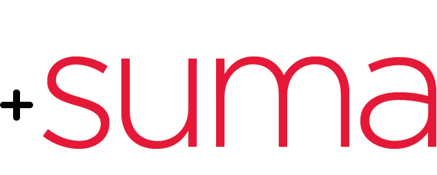

Overview
=====

Suma comprises a set of tools, including a mobile tablet-based (i.e. Apple iPad) data collection application, that will allow library staff to collect, aggregate, and interactively analyze real-time data about the usage of physical space and services. This tool will support the collection of more fine-grained data about physical space usage patterns by supporting the annotation of users with "activities." The data that this tool provides will allow the libraries to build on existing assessment practices by significantly improving our ability to analyze physical space usage trends against various milestones, as well as generating more dynamic and current data visualizations. As a result, this data can be both collected and utilized more frequently and at a much wider scope than before with relative ease.

This project is currently being used at NC State as a pilot project for a wider deployment. Examples of the current and planned uses for this toolkit include the collection and analysis of data relating to:

* Building headcounts
* Reference desk transactions
* Experimental technology usage
* Media production activities
* Experimental furniture usage

Disclaimer
======================
We have worked hard to make the code as stable as possible, but are eager to receive feedback on any issues you discover. While we at NCSU Libraries' have been using it in a production capacity since July 2011 with great success, and several other institutions have successfully implemented this code, you should still take appropriate precautions when deploying this application. These include but are not limited to carefully backing up databases, monitoring error logs, maintaining close relationships with users, and reporting any problems back to the project team. Thank you for helping to ensure that this project continues to grow.

As a safeguard, all JSON input from the client is logged. This will lead to large log files, but it allows for data recovery in the case of database problems or improperly rejected data. See the information about "JSON INPUT" entries in LOGS.md for more information. **We at NCSU Libraries have never needed to make use of this recovery feature.**

Documentation
==============

How to contribute?
===================
You want to contribute some code? Maybe some data reports, bug fixes, new clients, or even new core features? Awesome! Just contact us or fork the code on GitHub and create a pull request.

Project URLs
============
* Project page: http://www.lib.ncsu.edu/dli/projects/spaceassesstool/
* Repository: https://github.com/cazzerson/suma

Suma Community
==============

If you would like to be invited to a google group for the Suma users community, please email Joyce Chapman at joyce DOT chapman AT gmail DOT com

Credits and contacts
=====================

* Jason Casden (jmcasden AT ncsu DOT edu) – Project lead.
* Joyce Chapman (joyce DOT chapman AT gmail DOT com) – Community development and data analysis specialist.
* Bret Davidson - Technical lead.
* Rob Rucker – Project team member and our first stakeholder. Research Information Services department head responsible for NCSU D. H. Hill Libraries head counts and reference desk transactions.
* Eric McEachern – Backend developer, responsible for much of the development of the server-side components.
* Rusty Earl – Backend developer and technical consultant.
